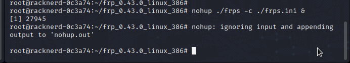

## 使用FRP做穿透服务器，自定义自己的服务器，放弃Ngrok

- [x] 一台公网服务器，linux系统

# FRP服务器搭建

首先我们使用wget命令在服务器上下载最新的FRP

我们打开FRP的GitHub仓库

https://github.com/fatedier/frp


我们进入Releases


选择我们需要的版本，如果你的linux基于树莓派，是arm的，我们就下载arm版本

但是服务器和一般linux都是amd64版本！

所以我们下载`frp_0.43.0_linux_amd64.tar.gz`！如果你的客户端是树莓派

或者服务器是树莓派，arm架构的CPU，那你应该下载`frp_0.43.0_linux_arm64.tar.gz`！

我们右键要下载的文件，选择复制下载链接


之后我们连接上我们的服务器，使用ssh客户端，或者使用下面的命令

`ssh root@服务器ip`

如果它询问你是否接受证书`yes|no|..`我们输入yes并回车！

之后它就会请你输入服务器的登录密码！


登陆成功！

之后我们使用wget命令来下载FRP客户端


下载成功，我们解压到本地，使用如下命令

`tar -zxvf xxxxxxx.tar.gz`


解压成功！我们进去刚刚解压出来的文件夹里


- 注意！:我们可以看到既有frpc也有frps，我们在服务器只需要使用到frps，s是server（服务器）的意思，而在我们本地linux，我们则需要使用frpc!

之后让我们来配置一下Frps.ini服务器文件！


我们往里面添加如下参数


```
[common]
bind_port = 7000          //要与后面配置的本地要穿透的客户端.ini文件统一，用于连接到服务器

dashboard_port = 9999    //网页访问的端口，我设置了9999，所以浏览器这样访问ip:9999
dashboard_user = admin    //网页登录账号
dashbard_pwd = 123456     //网页登录密码

```

之后我们保存后，使用 `./frps -c ./frps.ini`命令即可启动


我们发现启动失败，我们使用`arch`命令看看系统的架构

我们发现是x86\_64，由此可知，我们的系统是X86架构，我们应该下载的版本是

`frp_0.43.0_linux_386.tar.gz`

我们重新下载并重新配置一下


运行成功！！

# 客户端部署


```
server_addr = 服务器IP
server_port = 用于与服务器通讯，需要和服务器的IP地址一致

type  = 看你需要转发什么流量，如果我使用TCP的payloads，我就使用TCP类型
local_port = 127.0.0.1 将本地端口转发
local_port = 将本地某个端口转发（注意，msf监听就是监听这里的127.0.0.1IP和转发出去的端口，但是生成的木马，需要指向到你的服务器IP和下面的端口）
remote_port = 服务器某一个端口

```

之后我们使用命令`./frpc -c ./frpc.ini`启动

之后我们在服务器这个ssh连接终端可以看到下面的内容


啊哈，显然我们已经连接成功了！

- 但我们服务器ssh连接断开后，就无法正常连接了

# 持久化命令，使得我们断开ssh后，命令仍在运行

我们使用下面的命令来完成

`nohup ./frps -c ./frps.ini &`




我们可以看到，服务器即使断开连接，我们本地仍可以连接

我们打开WebFRP看看

IP:你自己设置的端口，我设置了9999


成功，我们登陆一下

之后我们即可在服务器列表内找到自己的服务器，比如我转发了TCP，所以我可以在TCP处看到自己的服务器处于在线状态！

