##  Debian Linux 快速入门
- [ ] 学会创建与打开文件夹
- [ ] 学会使用Vim与Nano
- [ ] 学会安装应用
- [ ] root与普通用户

----

**文件夹**

我们在终端内输入 `ls` 列出该目录下所有文件

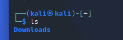

我们把目光投到Downloads

输入 `cd Downloads` 来进入Downloads这个文件夹

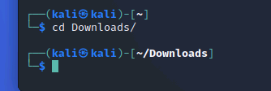

之后我们使用 `mkdir` 命令来创建一个文件夹

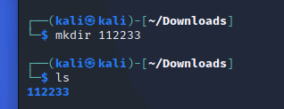

直接回到用户根目录（指定打开文件夹） `cd ~` 或者一步步回退到用户根目录（回到上一级文件夹） `cd ..`

在~目录下，一条命令进入到刚创建的文件夹里

`cd Downloads/112233/`

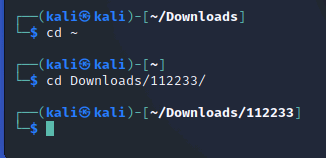

我们一键在这个文件夹里随便创建一个文件夹，名字一定要乱

`cd ~`

`mkdir Downloads/112233/djsijfrjdiigt` （乱填）

快速打开刚乱填的文件夹，使用tab按键智能补全代码

`cd Down` 摁下tab

`cd Downloads/11` 摁下tab

`cd Downloads/112233/djs` 摁下tab

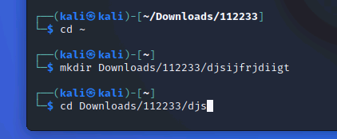

你就得到了这条命令 `cd Downloads/112233/djsijfrjdiigt/` ，此时只需要回车，就能进入这个文件夹

----

# 在此文件夹创建一个txt文本文件（使用vim）

*Vim，可以创建与打开的可不止只有txt（文本文件），事实上它还可以打开Html（超文本标记语言），c（C语言源码），py（python源码），conf（配置文件等等）*

`vim 111.txt`

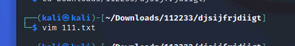

之后你会进入一个全是波浪线的界面

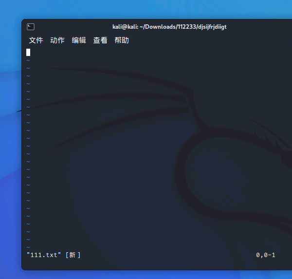

你会发现什么也输入不了，此时，我们摁下键盘上的字母 “i”

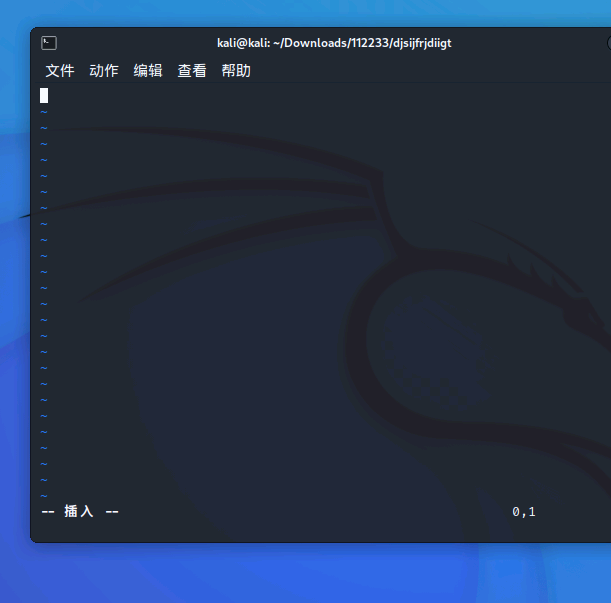

终端左下角出现“就绪”的英语，你会发现现在可以自由输入任何东西

那么，我们应该如何保存呢？

我们摁下键盘左上角的**esc**，此时终端左下角的“就绪”消失，我们输入 `:wq` 注意必须带上英文 **_“:”_** 

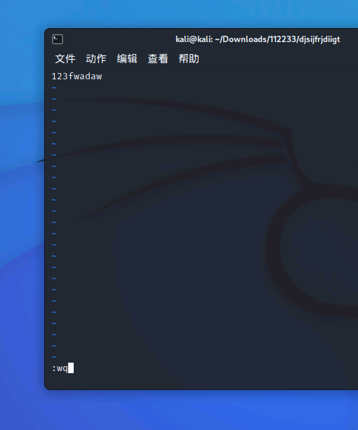

`:wq` 于终端左下角可见，意为保存并退出，回车确定

如果成功，我们将回到终端

我们输入 `cat 111.txt` 即可直接查看你刚刚输入的内容

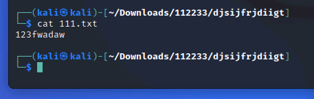

----

# 在此文件夹创建一个txt文本文件（使用nano）

`nano 222.txt`

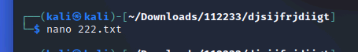

我们创建后即可直接输入你想输入的内容，事实上，nano比vim傻瓜，也就是方便操作。

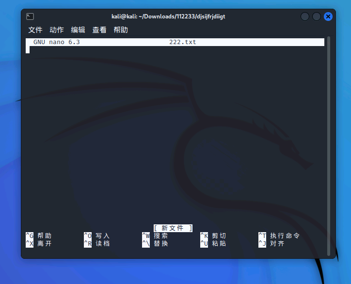

我们将如何保存与退出？

我们使用组合键 **_Ctrl+X_** 退出，这时会问你是否保存

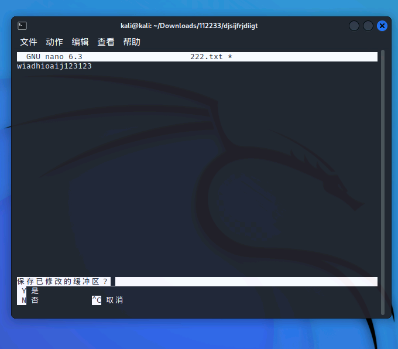

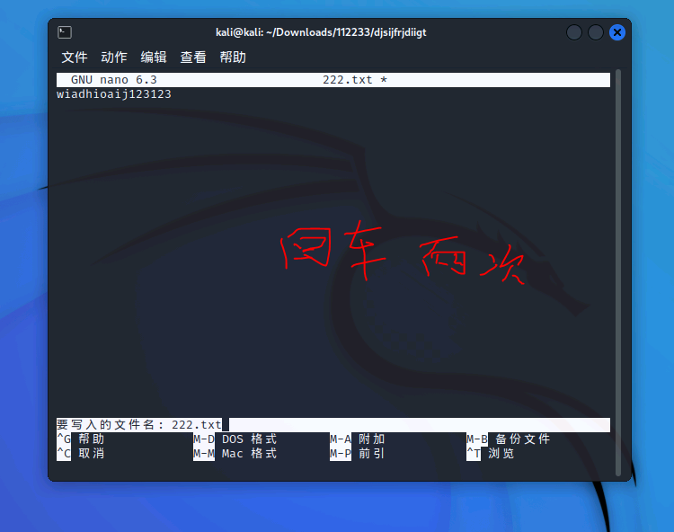

`Y（yes是） / N（no否） / C（cancel取消）`

我们输入**_Y_**，回车两次，直至回到终端内

我们使用 `cat 222.txt` 查看刚输入的内容

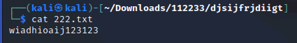

**_注：虽然nano比vim方便，但我要求你必须使用与熟悉vim！_**

----

我们试着用vim创建一个Python源码文件。

我们将用到Python语法，如print输出函数

vim 123.py

在里面输入print ("Hello")

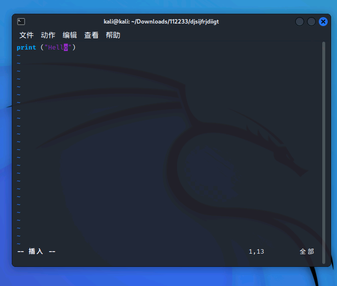

_注：Python，大小写，中英文敏感_

_所以print的p不能大写，"(的符号也不能使用中文_

保存后，我们在终端输入 `ls` 列出该目录下所有文件，此时我们可以看到用vim创建的111.txt和123.py，以及nano创建的222.txt

我们应该如何运行刚刚的123.py（python源码）？

`python 123.py`

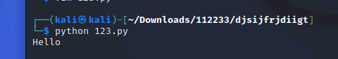

这样就可以运行这个python源码了！

----

# APT的使用

在Debian发行版中，我们使用apt去安装、删除软件（注：kali基于Debian开发）

而CentOS使用yum，Arch使用pacman

我们在安装应用时需要root（管理员）权限

所以我们需要在命令最前面加上`sudo`来表示这条命令使用root权限运行，如：

`sudo apt ...`

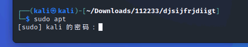

当你使用sudo时，它会想你索取系统密码，你会发现什么都输入不了，事实上，终端为了安全起见，你输入的任何东西它都不会进行显示，但你的密码事实上已经输入了，只是终端不显示。当你输入完成时，回车即可。

**我们如何知道自己是否处于Root权限下**

- [x] 当终端前面的$不是$，而是#时，即代表你处于Root用户下
- [x] 使用 `whoami` 命令 
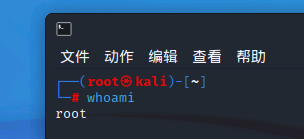

----

# 使用dpkg命令安装.deb后缀的软件包

我们在火狐浏览器里面搜索，搜狗输入法Linux版

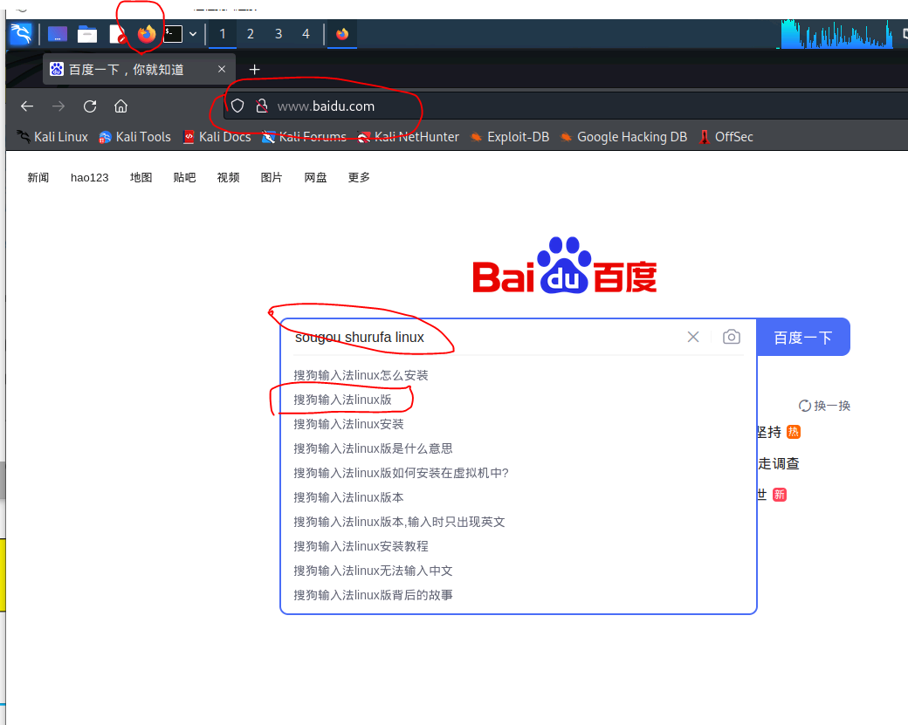

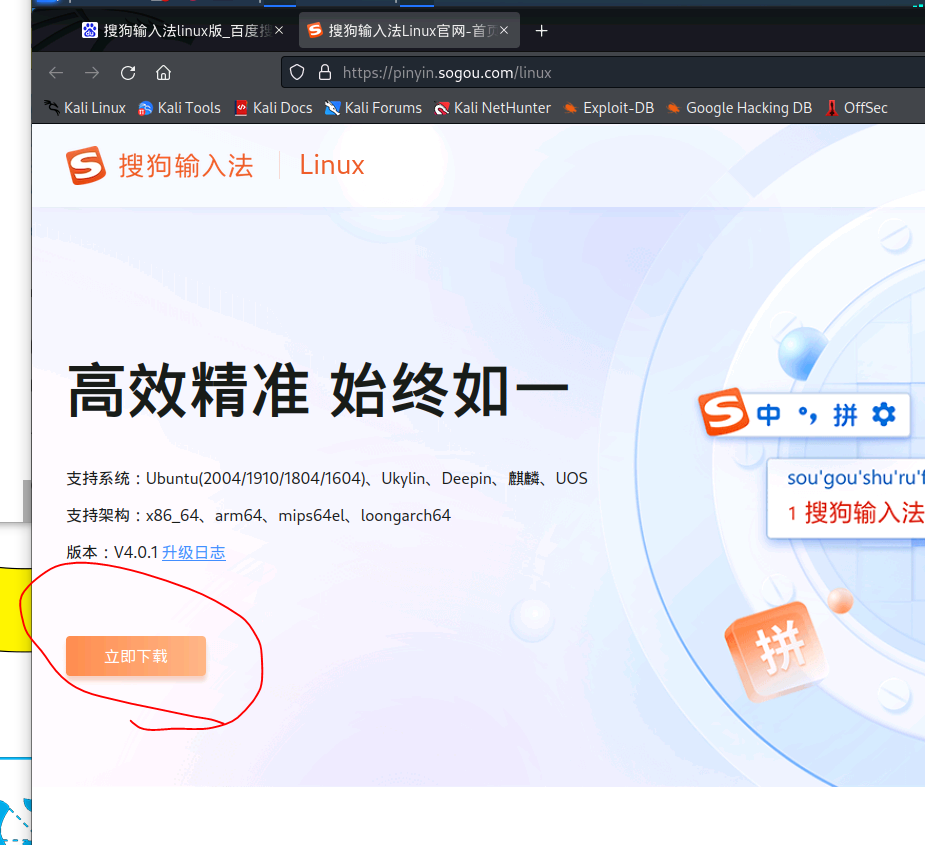

**我们在下载deb格式里选择第一项 “x86_64” 格式**

*下载完成后，我们打开终端*

我们进入浏览器默认下载的Downloads文件夹里（目录为 ~/Downloads）

我们输入`ls`列出该文件夹内所有文件，我们可以看到一个名为“sogoupinyin_xx.xx.xx_amd64.deb”的文件

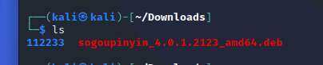

我们应该如何安装它？

- [x] Root权限-在命令前面使用sudo (`sudo su`命令可以半永久化进入Root)
- [x] dpkg命令-使用 "-i" 参数

我们在终端内输入`sudo dpkg -i sogoupinyin_xx.xx.xx_amd64.deb `来安装这个deb软件包

（**这里采取`sudo su`半永久进入Root的方法，所以在命令前面不再需要加上sudo**，! *该方法有一定风险* !，小白切勿乱试。列如大名鼎鼎的`sudo rm -rf /*`的意思实际上是，以管理员Root权限，强制删除根目录”/“所有文件。属于花样作死的一种）

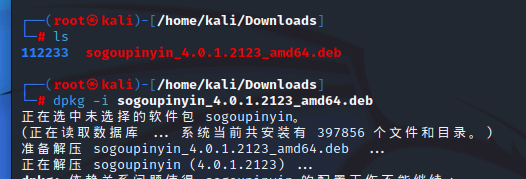

**注：善用Tab按键补全命令！**

在安装过程中它会询问你是否继续（Y/n），因为Y是大写的，如果你什么都不输入，直接回车，它默认是Y-同意的。如果你遇到的是y/n，那么回车将没有意义。

我们在安装时，也可以通过 “-y” 参数去事先同意，例如

`sudo apt install nginx -y`

我们也可以通过apt去安装一个软件，例如安装Nginx（事实上，Kali已经自带安装了Nginx）

我们可以执行如下命令去安装

`sudo apt install nginx`

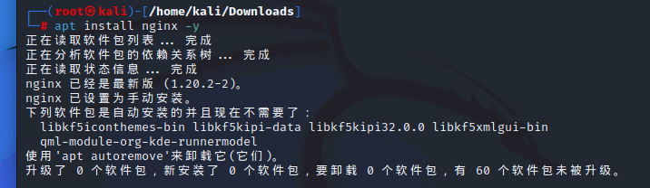

**事实上，你的搜狗输入法是安装失败的，你的依赖环境没有安装上**

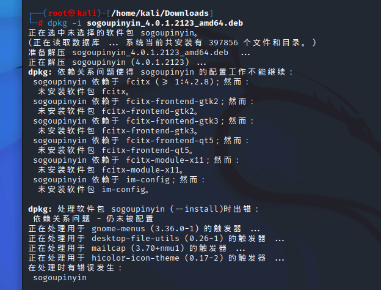

我们可以执行`apt --fix-broken install`命令来解决这个依赖环境问题

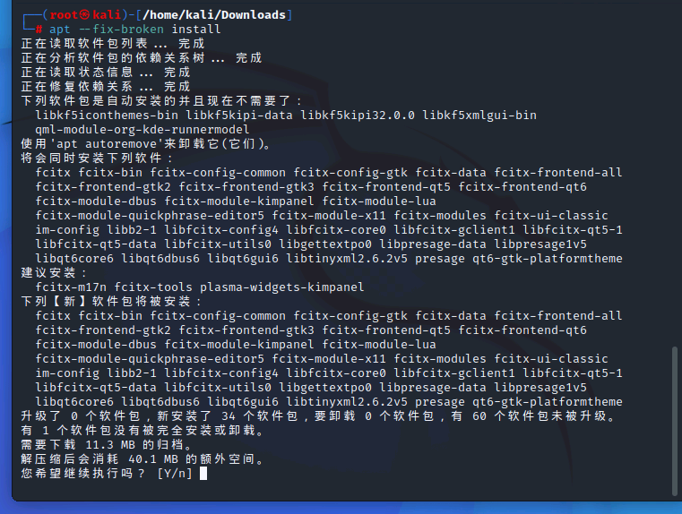

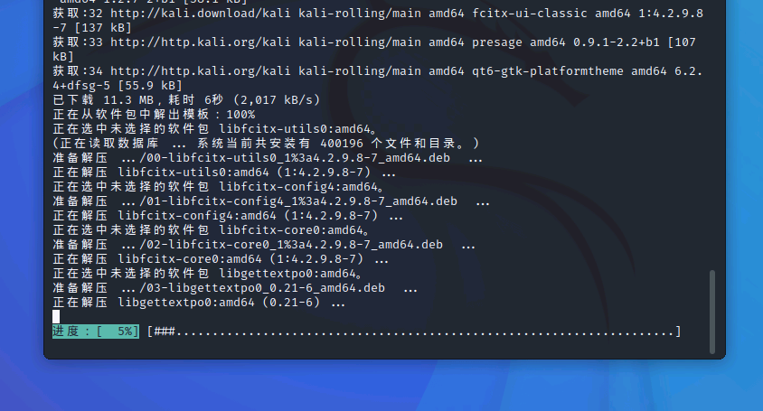

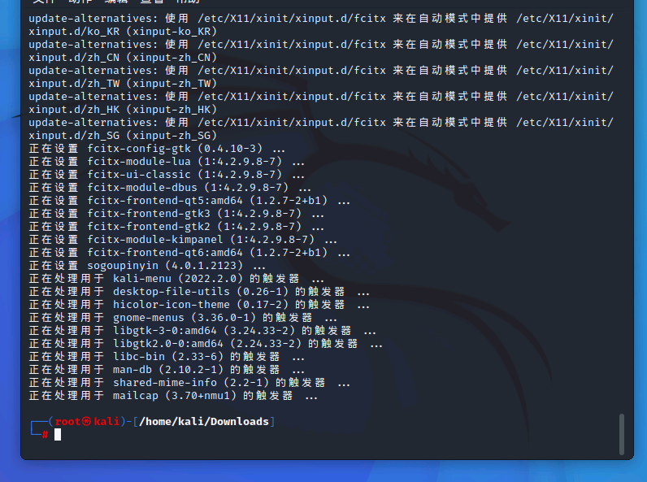

**我们再次执行安装命令，就可以安装上了**

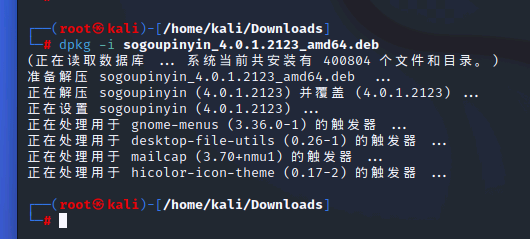

(**注：事实上`apt -f install -y`也能一键安装依赖，但是会安装失败，那我们我们尝试使用`apt install xxxxx`来手动一个个安装，此时，apt会提示你“找不到这个包，安装失败。**这时，我们需要更改”源“，这个”源“可以被世界各地的大学所提供，我们在中国，所以换成中科大/清华/阿里巴巴之类的中国源会快很多。而我们上面遇到的问题，就是一个应用，在系统应用商店里面没有，我们需要下载一个”应用汇“来安装我们需要的软件，而这个方式在Linux里，也叫做**换源**)

----

# 作业

- [ ] **百度搜索：Kali源，以及kali换源教程，使用vim更换成国内源（注，请勿删除#的注释内容，其次，必须使用vim来操作，nano不及格！)**
- [ ] **用vim，抄写几句英文短句，随便命名，必须放在”/Downloads/000/“文件夹内**

- [ ] **在网络上学习cp（复制命令）、mv（剪切/重命名命令），wget（下载命令）、以及一些基础命令，例如重启，删除**

- [ ] **成功安装，并使用搜狗输入法**
