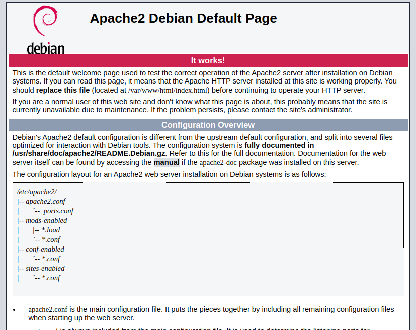
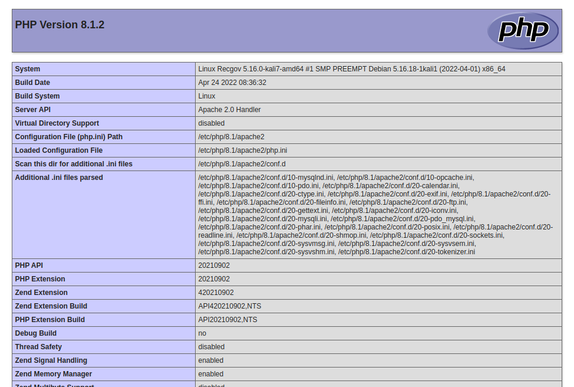
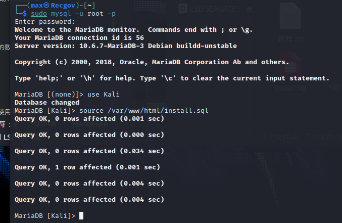
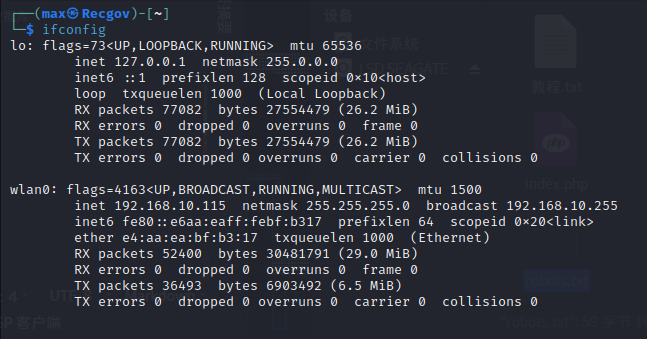

## 网站搭建-LAMP

Kali Linux实际上内置了Apache、Nginx、PHP和MySQL，满足LAMP和LNMP环境，省得我们再去部署

# 我们这里使用LAMP作为生产力环境

首先我们安装Apache PHP模块，用下面命令来安装

`sudo apt install libapache2-mod-php`

我们通过下面命令来重启Apache，此时，Linux会向你索要系统密码

`sudo systemctl restart apache2`

另外再安装MySQL和GD PHP扩展

`sudo apt install php-mysql php-gd`

要测试Web服务器是否已正确配置以进行PHP处理，使用以下代码在/var/www/html目录中创建一个名为info.php的新文件：

```
<?php
phpinfo();

```
保存文件后，我们在浏览器输入“127.0.0.1”则可以看到Apache的欢迎页



之后我们在“127.0.0.1”后加上“/info.php”，也就是“127.0.0.1/info.php”

我们即可看到PHP的详细页，当出现这个页面，即代表PHP正常可用



----

# MySQL数据库的创建

之后我们需要创建一个MySQL数据库

首先我们输入下面的命令启动数据库

`systemctl start mysql`

此时，系统会再次向你索要root密码

启动MySQL后，由于是第一次启动，MySQL是没有密码的，我们需要使用下面的命令创建MySQL的密码

`sudo mysql_secure_installation`

输入后，我们根据提示输入两次密码，即可完成MySQL数据库root登录密码的创建

（注意，在设置过程中，会提示删除是否anonymous用户，是否拒绝root的远程访问，是否删除测试用的数据库等，这些都需要根据自己的实际情况进行选择。）

之后，我们需要使用下面的命令来重启MySQL

`sudo /etc/init.d/mysqld restart`

之后我们输入下面的命令来进入数据库

`mysql -u root -p`

之后，我们来创建一个普通数据库

`create DATABASE Kali;`

这样，我们就创建了一个名为“Kali”的数据库（这里的K为大写）

下面，我们需要为这个普通数据库（Kali）创建用户

`grant all privileges on 数据库名称.*to 数据库用户名@'授权范围' identified by '数据库用户名的密码';`

下面是一条实例

`grant all privileges on Kali.*to Kali@'%' identified by 'Kali';`

（%代表授权全网访问，如果是localhost即代表授权本机访问）

这里我们就为Kali这个名称的数据库，创建了一个数据库用户名为“Kali”，和密码为“Kali”的数据库用户

最终，我们要使权限生效

`flush privileges;`

# 部署一个钓鱼网站

我们先删除Apache2网站根目录所有文件

`rm -rf /var/www/html/*`

我们再执行如下命令来解压短信轰炸机源码到网站根目录

`sudo unzip dy.zip -d /var/www/html/`

我们需要修改网站文件来对接数据库，而这个网站源码，对接数据库的源码文件是这个"config.php"

`sudo vim /var/www/html/config.php`

由于这个源码内附带一个".sql"文件，需要我们手动导入数据库

所以，我们输入

`sudo mysql -u root -p`

登录root数据库后，我们需要切换用户到刚刚创建的数据库

`use Kali`

之后我们导入".sql"文件

`source /var/www/html/install.sql`



完成！

之后我们在浏览器打开"127.0.0.1"即可

如果是局域网访问，那么我们需要用到如下命令

`ifconfig`



我们可以看到下面的第二行“192.168.10.115”

只要在同一局域网内的设备，浏览器打开这个IP地址即可访问Kali本机的网站

而公网也同理，你需要一个公网IP，其实这里我更推荐使用VPS服务器，因为普通电脑不适合做网站，或者说，不适合当网站服务器来用
