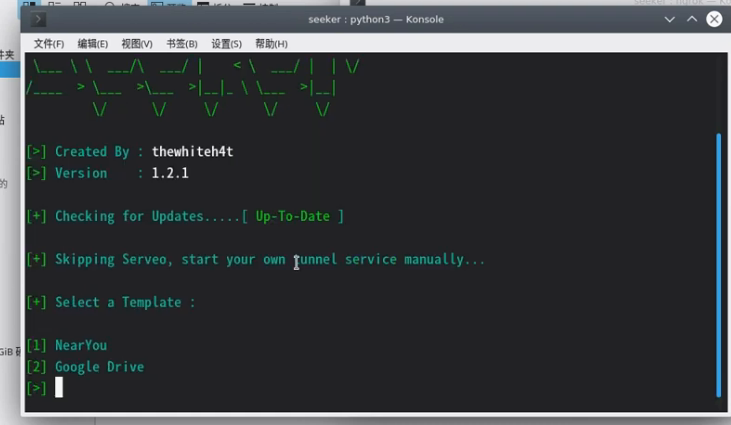

## Seeker GPS经纬度定位 真正的高精度定位

- [x] 确保Linux已安装Python3，PHP等..（事实上，运行Seeker脚本后就会自动帮你检查并安装环境，而Kali内置安装了需要的环境）

- [x] 注册一个Ngrok穿透用户（ngrok.com）

----

# Seeker可以做到什么

Seeker 拥有一个请求位置权限的虚假网站，如果目标允许，我们可以获得：

经度

纬度

准确性

海拔 - 并不总是可用

方向 - 仅在用户移动时可用

速度 - 仅在用户移动时可用

除了位置信息，我们还可以在没有任何权限的情况下获取设备信息：

使用 Canvas 指纹识别的唯一 ID

设备型号 - 并非始终可用

操作系统

平台

CPU 核心数 - 近似结果

RAM 量 - 近似结果

屏幕分辨率

显卡信息

浏览器名称和版本

公共 IP 地址

本地 IP 地址

本地端口

收到上述信息后，将执行自动 IP 地址侦察。

----

# GPS与IP定位的差别

其他工具和服务提供的 IP 地理位置根本不准确，并且没有给出目标的位置，而是 ISP 的大致位置。

Seeker 使用 HTML API 并获得位置权限，然后使用设备中存在的 GPS 硬件获取经度和纬度，因此 Seeker 最适合智能手机，如果 GPS 硬件不存在，例如在笔记本电脑上，Seeker 回退到 IP 地理定位或者它会寻找缓存坐标。

一般来说，如果用户接受位置许可，则接收到的信息的准确度可以精确到大约 30 米

准确性取决于您可能控制也可能无法控制的多个因素，例如：

- 设备 - 无法在 GPS 损坏的笔记本电脑或手机上工作

- 浏览器 - 一些浏览器会阻止 JavaScript

- GPS 校准 - 如果 GPS 未校准，您可能会得到不准确的结果，这很常见

----

# 可用模板：

0 NearYou

1 Google Drive

2 WhatsApp 

3 Telegram

4 Zoom 

## Linux安装命令

# Kali Linux / Arch Linux / Ubuntu / Parrot OS / Termux

```
git clone https://github.com/thewhiteh4t/seeker.git
cd seeker/
chmod +x install.sh
./install.sh
```

# BlackArch Linux
`sudo pacman -S seeker`

# Docker
`docker pull thewhiteh4t/seeker`

## 用法

```
python3 seeker.py -h

usage: seeker.py [-h] [-k KML] [-p PORT] [-u] [-v]

options:
  -h, --help            show this help message and exit
  -k KML, --kml KML     KML filename
  -p PORT, --port PORT  Web server port [ Default : 8080 ]
  -u, --update          Check for updates
  -v, --version         Prints version

##################
# Usage Examples #
##################

# Step 1 : In first terminal
$ python3 seeker.py

# Step 2 : In second terminal start a tunnel service such as ngrok
$ ./ngrok http 8080

###########
# Options #
###########

# Ouput KML File for Google Earth
$ python3 seeker.py -k <filename>

# Use Custom Port
$ python3 seeker.py -p 1337
$ ./ngrok http 1337

################
# Docker Usage #
################

# Step 1
$ docker network create ngroknet

# Step 2
$ docker run --rm -it --net ngroknet --name seeker thewhiteh4t/seeker

# Step 3
$ docker run --rm -it --net ngroknet --name ngrok wernight/ngrok ngrok http seeker:8080
```

# 本地隧道-作为 ngrok 的替代品

`ssh -R 80:localhost:8080 nokey@localhost.run`

## 实际操作

我们打开一个终端

使用git clone命令将Seeker储存库克隆到Linux本地

`git clone https://github.com/thewhiteh4t/seeker.git`


克隆成功后，我们打开这个文件夹

`cd seeker/`

之后我们再使用chmod命令给这个bash文件执行能力。

`chmod +x install.sh`

再使用下面命令执行安装（需要root权限）

`bash install.sh`


至此，Seeker已完全安装完毕，除外，我们还需要安装Ngrok，将内网机器穿透到公网，这样世界各地的人都能访问你的定位网站

----

# Ngrok安装

首先我们需要到ngrok.com这个网站注册一个账号

当我们注册完毕，登录后

可以看到这个界面


我们右键Linux这里，并选择复制链接地址


之后我们在终端输入

`wget 刚刚复制的内容，粘贴上去`

使用wget来下载刚刚复制的内容


之后我们需要使用tar命令来解压这个压缩包

`tar -zxvf 下载过来的文件名称`

解压得到一个名为ngrok的文件

我们把目光放回到ngrok.com这个网站

我们执行 “2. Connect your account” 下面给出的命令（每个人都是不同的）

值得注意的是，我们需要在代码最前面加上"./"

成功后如下


此时，ngrok可以正常使用了！！！

之后我们在有ngrok这个文件的文件夹下执行

`ngrok http 80`

它就会帮你将HTTP流量转到80端口

## 值得注意的是，之后我们使用到的MSF渗透，对全世界任一设备进行渗透，也需要用到Ngrok

我们需要这条命令来执行转发TCP流量到公网 `ngrok tcp msf里面你指定的监听端口`

当然，这已经是后话了

----

# 使用Seeker

当我们启动了ngrok转发到80端口

我们就可以使用`python3 seeker.py`这条命令，在seeker目录下运行seeker本体了

当我们输入`python seeker.py -h`时，它就会给出你一个帮助文档。

我们在这里执行这个，手动模式 `python3 seeker.py -t manual`

此时，出现这个界面就可以通过输入123来选择模版和自定义内容了！



我们回看到ngrok这个终端，我们将这一行发给别人打开，即可完成定位（前提是对方成功上钩）


